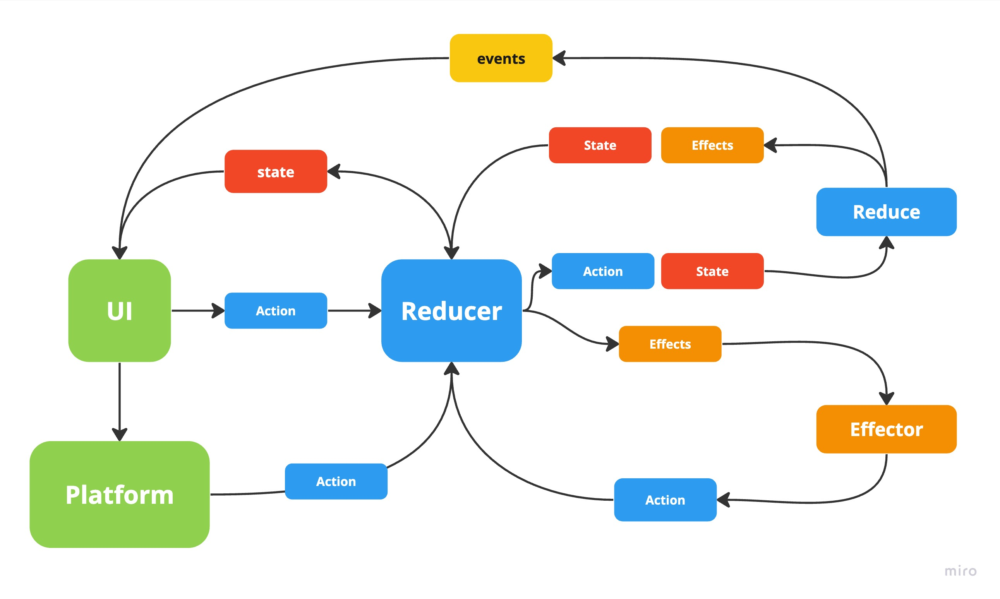

# Android Compose UDF Implementation



**State** - Состояние UI

**Action** - действия отправляемые в Reducer (ViewModel)

**Event** - события для UI  (не меняет State, можно использовать для событий навигации)

**Effect** - Побочные эффекты (Асинхронные, Многопоточные операции), вроде отправки запросов на сервер и тп (не меняет State)

**Reducer** (ViewModel, метод dispatch) - Получает действия (Action) с UI или Platform (Android System) или Effector. Передает Action и текущий State в reduce. Reducer тем самым обновляет State на полученный и запускает полученные эффекты передав в Effector

**Effector** - рантайм эффектов, запускает полученные эффекты асинхронно. После завершения эффект может вернуть Action, который передается в Reducer для обработки

**reduce** - получает Action и State, синхронно применяет action к state и возращает обновленный State и список Side Effect'ов в Reducer. Так же может производить events

Activity
```kotlin
viewModel.dispatch(Action.LoadContent)
```

ViewModel
```kotlin
fun reduce(action: Action, state: State): Update<State, Effect, Event> = when(action) {
    is Action.LoadContent -> {
        Update(state.copy(isLoading = true), Effect.FetchData)
    }
    is Action.UpdateContent -> {
        Update(state.copy(isLoading = false, content = action.content))
    }
}
```
```kotlin
fun affect(effect: Effect): Flow<EffectResult<Action, Event>> = flow {
    when(effect) {
        is Effect.FetchData -> {
            fetchDataUseCase().collect { content ->
                emit(UpdateContent(content).asResult())
            }
        }
    }
}
```

UI

Compose

```kotlin
@Composable 
fun UI(
    state: State,
    events: Events,
    dispatch: (Action) -> Unit
) {

    val context = LocalContext.current

    OnEvent(events = events) { event ->
        when(event) {
            is ShowMessage -> showToast(context, event.message)
        }
    }

    UserProfile(
        user = state.user,
        isLoading = state.isLoading
    )
    
    DetailContent(
        content = state.content
    )

    Button(
        onClick = {
            dispatch(Action.LoadContent)
        }
    ) {
        Text("Load Details")
    }
}
```